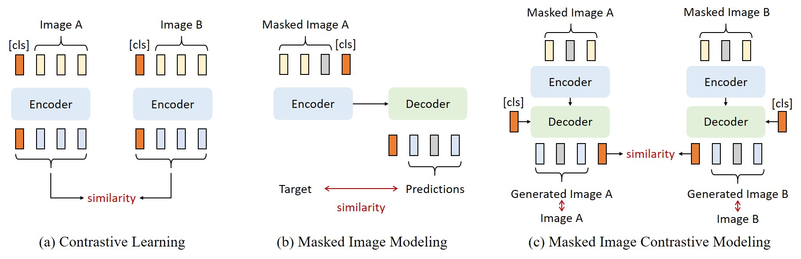

# MICM: Rethinking Unsupervised Pretraining for Enhanced Few-shot Learning

This repository contains the official PyTorch implementation of the following paper:

> [**MICM: Rethinking Unsupervised Pretraining for Enhanced Few-shot Learning**](https://arxiv.org/abs/2301.11929)  
> **Authors**: Zhenyu Zhang*, [Guangyao Chen*](https://icgy96.github.io/), [Yixiong Zou](https://scholar.google.com/citations?user=VXxF0mcAAAAJ&hl=zh-CN), Zhimeng Huang, Yuhua Li, and Ruixuan Li  
> Presented at the 32nd ACM International Conference on Multimedia (MM ’24), Oral Presentation.  
> [arXiv](https://arxiv.org/abs/2408.13385) | [Bibtex](https://github.com/iCGY96/MICM#citation)




## Dataset and Environment Setup

**Dataset:** Please refer to [SemanticPrompt](https://github.com/WentaoChen0813/SemanticPrompt).

**Conda Environment:** Python 3.8, PyTorch 1.11, CUDA 11.3. Use the provided YAML file to create the conda environment:

```
conda env create -f environment.yml
source activate MICM

```

## 1. Unsupervised Pretraining

Example using miniImageNet dataset:
```
CUDA_VISIBLE_DEVICES=0,1,2,3 python -m torch.distributed.launch --nproc_per_node=4 --master_port=29505 main_micm.py --data_path ./miniImagenet/base --eval_data_path ./dataset/miniImagenet/novel --output_dir ./mini_logs/ --evaluate_freq 50 --visualization_freq 50 --use_fp16 True --lr 0.0005 --epochs 1600 --lambda1 1 --lambda2 0 --lambda3 1 --lambda4 1 --batch_size_per_gpu 64 --global_crops_scale 0.4 1 --local_crops_scale 0.05 0.4
```

Checkpoints for unsupervised training phase available here: [checkpoint](https://drive.google.com/drive/folders/1blGgC_1F9-RLaqYQJalQRUTTZxPi2Nwa?usp=drive_link).


## 2. Pseudo-label training

**For MiniImageNet:**

```
CUDA_VISIBLE_DEVICES=0 python -m torch.distributed.launch --nproc_per_node=1 --master_port=29505 main_micm.py --pretrained_path ./mini_logs/_gpu6_2024-01-01_12-41-07/ --pretrained_file checkpoint1250.pth --data_path ./dataset/miniImagenet/base --eval_data_path /./dataset/miniImagenet/novel --output_dir ./mini_logs/ --evaluate_freq 1 --saveckp_freq 1 --visualization_freq 50 --use_fp16 True --lr 0.0005 --epochs 1600 --lambda1 0 --lambda2 0.1 --lambda3 0 --lambda4 1 --batch_size_per_gpu 128 --local_crops_number 0 --global_crops_scale 0.4 1 --local_crops_scale 0.05 0.4
```

**For CIFAR-FS:**

```
CUDA_VISIBLE_DEVICES=0 python -m torch.distributed.launch --nproc_per_node=1 --master_port=29505 main_micm.py --pretrained_path ./cifar_logs/_gpu6_2024-01-01_12-41-07/ --pretrained_file checkpoint0800.pth --data_path ./dataset/cifar100/base --eval_data_path ./dataset/cifar100/novel --output_dir ./cifar_logs/ --evaluate_freq 1 --saveckp_freq 1 --visualization_freq 50 --use_fp16 True --lr 0.0005 --epochs 1600 --lambda1 0 --lambda2 0.7 --lambda3 0 --lambda4 1 --batch_size_per_gpu 128 --local_crops_number 0 --global_crops_scale 0.4 1 --local_crops_scale 0.05 0.4
```
Checkpoints for pseudo training phase available here: [checkpoint](https://drive.google.com/drive/folders/1ZW6QSB66olx3XE0mo78lIemZGA2PME0l?usp=drive_link)


## 3. Evaluation

> 1. Modify the 'server_dict' in eval_micm.py
> 2. For 5-way 1-shot task, run:

**For MiniImageNet and TieredImagNet:**

```
python eval_micm.py \
--num_ways 5 \
--num_shots 1 \
--server mini / tiered \
--arch vit_small \
--output_dir .logs/ \
--ckp_path ./path_to_ckp/ \
--ckpt_filename checkpoint1250.pth \
--evaluation_method cosine
```


**For CIFAR-FS:**

```
python eval_micm.py \
--num_ways 5 \
--num_shots 1 \
--server fs \
--arch vit_half_small \
--output_dir ./logs/ \
--ckp_path ./path_to_ckp/ \
--ckpt_filename checkpoint0950.pth \
--evaluation_method cosine

```


## Citation

If you find our work useful for your research, please consider giving a star :star: and citation :beer::

```BibTeX
@inproceedings{zhang2024micm,
  title={MICM: Rethinking Unsupervised Pretraining for Enhanced Few-shot Learning},
  author={Zhang, Zhenyu and Chen, Guangyao and Zou, Yixiong and Huang, Zhimeng and Li, Yuhua and Li, Ruixuan},
  booktitle={ACM Multimedia},
  year={2024}
}
```

## Acknowledgement
his repo is developed based on [SMKD](https://github.com/HL-hanlin/SMKD), [iBOT](https://github.com/bytedance/ibot), [BECLR](https://github.com/stypoumic/BECLR) and [SemanticPrompt](https://github.com/WentaoChen0813/SemanticPrompt). Thanks for their wonderful codebases.